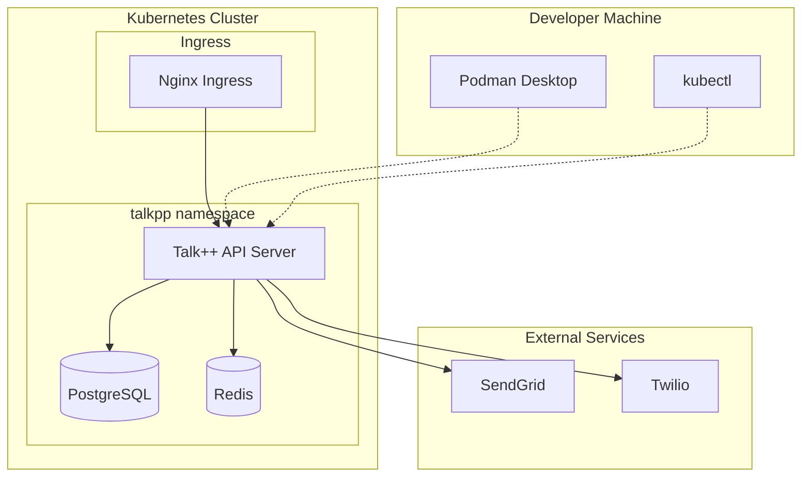

# Talk++ Language Module & Rust Serverless Runtime

A natural language DSL compiler that generates polyglot serverless functions with integrated service support.


## 🚀 Quick Start

### Prerequisites

- **Rust 1.77+** (for development)
- **Podman Desktop** or **Podman CLI** (for containerization)
- **Kubernetes cluster** (for deployment)
- **kubectl** (for cluster management)

### 🐳 Container Development with Podman

1. **Build the container image:**
```bash
./scripts/build-podman.sh
```

2. **Run locally with Podman Compose:**
```bash
# Copy environment template
cp .env.example .env
# Edit .env with your configuration

# Start all services
podman-compose up -d

# View logs
podman-compose logs -f talkpp-api
```

3. **Access the services:**
- **Talk++ API**: http://localhost:8080
- **PgAdmin**: http://localhost:8081 (admin@talkpp.dev / admin)
- **PostgreSQL**: localhost:5432
- **Redis**: localhost:6379

### ☸️ Kubernetes Deployment

1. **Deploy to Kubernetes:**
```bash
# Deploy everything
./scripts/deploy-k8s.sh

# Check deployment status
./scripts/deploy-k8s.sh status

# Run health check
./scripts/deploy-k8s.sh health

# Clean up deployment
./scripts/deploy-k8s.sh clean
```

2. **Access the application:**

**With Ingress (recommended):**
```bash
# Add to /etc/hosts
echo "127.0.0.1 talkpp.local api.talkpp.local" | sudo tee -a /etc/hosts

# Access via browser
open http://talkpp.local
```

**With NodePort:**
```bash
# Access directly via cluster IP
open http://localhost:30080
```

**With Port Forward:**
```bash
kubectl port-forward service/talkpp-api 8080:8080 -n talkpp
open http://localhost:8080
```

## 📝 Talk++ DSL Syntax

Write natural language workflows that compile to multiple target languages:

```talk++
// Basic user registration workflow
if new user registers then
  validate email using SendGrid
  store user data in PostgreSQL
  send welcome SMS using Twilio

// Advanced conditional logic
if payment received then
  amount: payment.amount
  if amount > 1000 then
    send high_value_alert using SendGrid
    create audit_log in PostgreSQL
  else
    send receipt using SendGrid
  
  update inventory in PostgreSQL
  send confirmation SMS using Twilio
```

## 🛠️ CLI Tools

### Compiler (`talkppc`)

```bash
# Compile to Rust
talkppc build -i workflow.tpp -o workflow.rs --target rust

# Compile to Python with optimization
talkppc build -i workflow.tpp --target python --optimization release

# Check syntax
talkppc check -i workflow.tpp

# Show supported languages
talkppc info
```

### Runtime (`talkpprun`)

```bash
# Simulate with mock services
talkpprun simulate -i workflow.rs --mock --event '{"user": "test@example.com"}'

# Execute with real services
talkpprun execute --function-id uuid --event '{"data": "value"}'

# List deployed functions
talkpprun list --detailed
```

## 🏗️ Architecture

### Compiler Pipeline
```
DSL Source → Lexer → Parser → AST → Code Generator → Target Code
   (.tpp)      ↓       ↓      ↓         ↓           (.rs/.py/.js/.ts/.sh)
              Tokens  Parse  Abstract  Rust/Python/JavaScript/TypeScript/Bash
                      Tree   Syntax    Function Generation
                             Tree
```

### Runtime Components

- **🧠 Compiler**: DSL → Multi-language code generation
- **⚡ Runtime**: Async execution engine with Tokio
- **🔒 Auth**: JWT-based authentication & authorization
- **🔌 Services**: SendGrid, Twilio, PostgreSQL integrations
- **🧪 Simulator**: Dry-run testing with mock services
- **🌐 API**: REST endpoints for function management
- **💻 CLI**: Command-line tools for development workflow

### Deployment Architecture



## 🐳 Container Images

The project uses **Podman-compatible Containerfiles** for maximum compatibility:

- **Multi-stage builds** for optimized images
- **Non-root user** for security
- **Alpine Linux** base for minimal size
- **Health checks** for container orchestration
- **Podman Desktop** integration ready

## ☸️ Kubernetes Resources

### Core Components
- **Namespace**: `talkpp` with resource quotas
- **Deployment**: Talk++ API server with 2 replicas
- **Services**: ClusterIP, NodePort, and LoadBalancer options
- **Ingress**: Nginx-based routing with TLS support
- **ConfigMaps**: Application configuration
- **Secrets**: Sensitive data management

### Data Services
- **PostgreSQL**: Persistent database with initialization scripts
- **Redis**: Caching and session storage
- **PVCs**: Persistent storage for data

### Observability
- **Health checks**: Liveness, readiness, and startup probes
- **Resource limits**: CPU and memory constraints
- **Logging**: Structured logs with tracing support
- **Metrics**: Prometheus-compatible endpoints

## 🔧 Development Workflow

### Local Development
```bash
# 1. Set up environment
cp .env.example .env
# Edit .env with your configuration

# 2. Start services with Podman
podman-compose up -d

# 3. Run tests
cargo test

# 4. Build and test changes
./scripts/build-podman.sh
```

### Deploy to Kubernetes
```bash
# 1. Build container image
./scripts/build-podman.sh

# 2. Deploy to cluster
./scripts/deploy-k8s.sh

# 3. Monitor deployment
kubectl get pods -n talkpp -w

# 4. View logs
kubectl logs -f deployment/talkpp-api -n talkpp
```

### Development with Podman Desktop

1. **Open Podman Desktop**
2. **Import the built image** (automatically available after build)
3. **Use the GUI** to manage containers and volumes
4. **Monitor logs and metrics** through the dashboard

## 🌐 REST API

### Authentication
```bash
POST /auth/login
POST /auth/register
POST /auth/refresh
```

### Function Management
```bash
GET    /functions          # List functions
POST   /functions          # Create function
GET    /functions/:id      # Get function details
PUT    /functions/:id      # Update function
DELETE /functions/:id      # Delete function
POST   /functions/:id/exec # Execute function
```

### Health & Monitoring
```bash
GET /health    # Health check
GET /ready     # Readiness check
GET /metrics   # Prometheus metrics
```

## 📊 Service Integrations

### SendGrid (Email)
```talk++
send welcome_email using SendGrid
send password_reset using SendGrid with template "reset"
```

### Twilio (SMS)
```talk++
send verification_code using Twilio
send alert_message using Twilio with priority "high"
```

### PostgreSQL (Database)
```talk++
store user_data in PostgreSQL
query user_profiles from PostgreSQL where active=true
update inventory in PostgreSQL set quantity=new_quantity
```

## 🧪 Testing

### Unit Tests
```bash
cargo test                    # All tests
cargo test compiler::         # Compiler tests
cargo test --package runtime  # Runtime tests
```

### Integration Tests
```bash
cargo test --test integration
```

### Container Tests
```bash
# Test container build and functionality
./scripts/build-podman.sh

# Test container deployment
podman run --rm localhost/talkpp:latest talkppc info
```

### Kubernetes Tests
```bash
# Deploy to test cluster
./scripts/deploy-k8s.sh

# Run health checks
./scripts/deploy-k8s.sh health

# Clean up
./scripts/deploy-k8s.sh clean
```

## 📦 Generated Code Examples

### Rust Output
```rust
use anyhow::Result;
use serde::{Deserialize, Serialize};
use tracing::info;

pub async fn handler(event: Event) -> Result<Response> {
    info!("Processing user registration");
    
    if event.data["action"] == "register" {
        send_email_sendgrid(&event.data["email"], "Welcome!").await?;
        store_postgresql("users", &event.data).await?;
        send_sms_twilio(&event.data["phone"], "Welcome to our platform!").await?;
    }
    
    Ok(Response::success("Registration processed"))
}
```

### Python Output
```python
import asyncio
import logging
from typing import Dict, Any

async def handler(event: Dict[str, Any]) -> Dict[str, Any]:
    logging.info("Processing user registration")
    
    if event["data"]["action"] == "register":
        await send_email_sendgrid(event["data"]["email"], "Welcome!")
        await store_postgresql("users", event["data"])
        await send_sms_twilio(event["data"]["phone"], "Welcome to our platform!")
    
    return {"success": True, "message": "Registration processed"}
```

## 🚀 Deployment Environments

### Development
- **Podman Compose** for local development
- **Mock services** enabled
- **Debug logging** active
- **Hot reload** with file watching

### Staging
- **Kubernetes** cluster deployment
- **Real services** with test credentials
- **Resource limits** enforced
- **Health monitoring** active

### Production
- **Kubernetes** with **Helm charts**
- **Production services** with real credentials
- **Horizontal Pod Autoscaling**
- **Full observability** stack

## 🔒 Security

### Container Security
- **Non-root user** (UID 1001)
- **Minimal base image** (Alpine Linux)
- **No package managers** in runtime image
- **Security contexts** in Kubernetes

### Application Security
- **JWT authentication** with secure secrets
- **Input validation** and sanitization
- **Environment variable** configuration
- **Secrets management** via Kubernetes secrets

### Network Security
- **Ingress TLS** termination
- **Network policies** for pod communication
- **Service mesh** ready (Istio compatible)

## 📈 Monitoring & Observability

### Metrics
- **Prometheus** compatible metrics endpoint
- **Custom metrics** for compilation and execution
- **Grafana dashboards** for visualization

### Logging
- **Structured logging** with `tracing`
- **JSON output** for log aggregation
- **Request tracing** with correlation IDs

### Health Checks
- **Liveness probes** for container health
- **Readiness probes** for traffic routing
- **Startup probes** for slow-starting containers

## 🛣️ Roadmap

### Current (v0.2.0)
- ✅ DSL compiler with multi-language support
- ✅ Basic service integrations
- ✅ Podman containerization
- ✅ Kubernetes deployment
- ✅ CLI tools

### Next (v0.3.0)
- 🔄 Web UI for function management
- 🔄 Advanced DSL features (loops, functions)
- 🔄 More service integrations
- 🔄 Performance optimizations

### Future (v1.0.0)
- 🔲 Visual DSL editor
- 🔲 Function marketplace
- 🔲 Advanced debugging tools
- 🔲 Multi-tenant support

## 🤝 Contributing

1. **Fork the repository**
2. **Create a feature branch**: `git checkout -b feature/amazing-feature`
3. **Make your changes** and test thoroughly
4. **Build and test containers**: `./scripts/build-podman.sh`
5. **Test Kubernetes deployment**: `./scripts/deploy-k8s.sh`
6. **Commit your changes**: `git commit -m 'Add amazing feature'`
7. **Push to the branch**: `git push origin feature/amazing-feature`
8. **Open a Pull Request**

### Development Environment Setup

```bash
# Clone and setup
git clone https://github.com/Diatonic-AI/TalkerAI.git
cd TalkerAI

# Install Rust toolchain
curl --proto '=https' --tlsv1.2 -sSf https://sh.rustup.rs | sh

# Install Podman Desktop (Ubuntu)
flatpak install flathub io.podman_desktop.PodmanDesktop

# Setup local environment
cp .env.example .env
# Edit .env with your settings

# Start development services
podman-compose up -d

# Run tests
cargo test
```

## 📄 License

This project is licensed under the MIT License - see the [LICENSE](LICENSE) file for details.

## 🙏 Acknowledgments

- **Rust Community** for excellent tooling and libraries
- **Podman Project** for secure containerization
- **Kubernetes** for orchestration capabilities
- **Service Providers** (SendGrid, Twilio) for integration APIs

## 📞 Support

- **Issues**: [GitHub Issues](https://github.com/Diatonic-AI/TalkerAI/issues)
- **Discussions**: [GitHub Discussions](https://github.com/Diatonic-AI/TalkerAI/discussions)
- **Documentation**: [Wiki](https://github.com/Diatonic-AI/TalkerAI/wiki)

---

**Talk++** - *Making serverless functions as easy as natural language* 🚀 