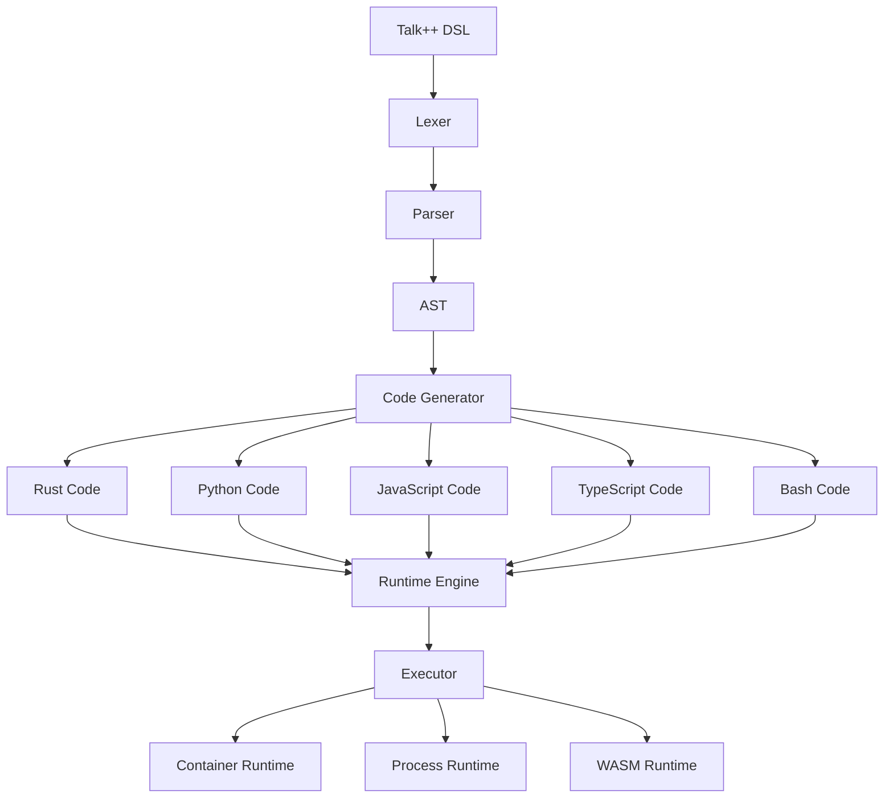

# Talk++ Language Module & Rust Serverless Runtime

> 🚀 **A polyglot conversational programming interface that converts natural language into executable functions**

Talk++ is a revolutionary DSL (Domain Specific Language) that allows you to write serverless functions using plain English conditional logic. It compiles your natural language instructions into secure, typed function workflows across multiple programming languages.

## ✨ Features

- **Natural Language DSL**: Write functions using plain English with if/then/else logic
- **Polyglot Support**: Compile to Rust, Python, JavaScript, TypeScript, and Bash
- **Secure Runtime**: Sandboxed execution with zero-trust access and credential management
- **LLM Integration**: AI-powered intent parsing and code generation
- **Service Integrations**: Built-in support for SendGrid, Twilio, PostgreSQL, and more
- **Dry-Run Simulation**: Test functions before deployment with comprehensive tracing
- **CLI Toolchain**: Developer-friendly command-line tools for compilation and execution

## 🏗️ Architecture



## 🚀 Quick Start

### Installation

```bash
# Clone the repository
git clone https://github.com/diatonicvisuals/talkplusplus.git
cd talkplusplus

# Build with Docker (recommended)
docker-compose up --build

# Or build with Rust
cargo build --release
```

### Your First Talk++ Function

Create a file `hello.tpp`:

```talk++
// Simple user registration workflow
if new user registers
then validate email using SendGrid
then store user data in PostgreSQL
then send welcome message using Twilio
```

Compile and run:

```bash
# Compile to Rust
talkppc build -i hello.tpp -o hello.rs --target rust

# Simulate execution
talkpprun simulate -i hello.rs --mock --loglevel debug

# Deploy to runtime
curl -X POST http://localhost:8080/deploy \
  -H "Content-Type: application/json" \
  -d '{"name": "hello", "source": "..."}'
```

## 📖 Talk++ DSL Syntax

### Basic Conditional Logic

```talk++
if new user registers
then validate email using SendGrid
then store user data in PostgreSQL
else
then log registration failure
```

### Advanced Conditions

```talk++
if file uploaded to S3 and file size > 1000000
then process image using ImageMagick
then store metadata in PostgreSQL
else
then store original file
```

### Variable Assignments

```talk++
user_email: "user@example.com"
notification_service: "Twilio"

if payment received
then send confirmation using notification_service
```

### Service Integrations

Talk++ supports these services out of the box:

- **SendGrid**: Email sending
- **Twilio**: SMS and voice
- **PostgreSQL**: Database operations
- **Redis**: Caching and sessions
- **S3**: File storage
- **ImageMagick**: Image processing

## 🛠️ CLI Tools

### `talkppc` - Compiler

```bash
# Compile to different target languages
talkppc build -i input.tpp -o output.rs --target rust
talkppc build -i input.tpp -o output.py --target python
talkppc build -i input.tpp -o output.js --target javascript

# Check syntax
talkppc check -i input.tpp

# Show supported languages
talkppc info
```

### `talkpprun` - Runtime

```bash
# Simulate function execution
talkpprun simulate -i function.rs --secrets .env --mock

# Execute deployed function
talkpprun execute -f function-id --event '{"user": "test"}'

# List deployed functions
talkpprun list
```

## 🌐 REST API

The Talk++ runtime provides a REST API for function management:

### Deploy Function
```bash
POST /deploy
{
  "name": "my-function",
  "source": "if new user registers then...",
  "language": "rust"
}
```

### Execute Function
```bash
POST /invoke/{function-id}
{
  "data": {"user": "john@example.com"},
  "context": {"source": "web"}
}
```

### List Functions
```bash
GET /functions
```

### Simulate Function
```bash
POST /simulate
{
  "source": "if new user registers then...",
  "config": {"mock_external_calls": true}
}
```

## 🧪 Examples

Check out the [`examples/`](./examples/) directory for more Talk++ DSL examples:

- [`hello.tpp`](./examples/hello.tpp) - Basic user registration workflow
- [`advanced.tpp`](./examples/advanced.tpp) - Complex conditional logic with assignments

## 🏃‍♂️ Development

### Prerequisites

- Rust 1.77+
- Docker & Docker Compose
- PostgreSQL 15+
- Redis 7+

### Project Structure

```
talkplusplus/
├── compiler/          # DSL compiler (lexer, parser, codegen)
├── runtime/           # Runtime execution engine
├── auth/              # Authentication & authorization
├── executor/          # Function execution (container, process, WASM)
├── simulator/         # Dry-run simulation and testing
├── wrappers/          # Language-specific runtime wrappers
├── cli/               # CLI tools (talkppc, talkpprun)
├── api-server/        # REST API server
├── frontend-server/   # Web UI server
├── docker/            # Docker configuration
├── examples/          # Example Talk++ functions
└── tests/             # Integration tests
```

### Running Tests

```bash
# Run all tests
cargo test

# Run compiler tests only
cargo test -p talkpp-compiler

# Run with coverage
cargo tarpaulin --out html
```

### Development with Docker

```bash
# Start development environment
docker-compose -f docker/docker-compose.yml up -d

# View logs
docker-compose logs -f talkpp-api

# Access services
# - API: http://localhost:8080
# - Frontend: http://localhost:3000
# - PgAdmin: http://localhost:8081
```

## 🗺️ Roadmap

### Phase 1: MVP ✅
- [x] Core DSL parser and compiler
- [x] Rust code generation
- [x] CLI tools (`talkppc`, `talkpprun`)
- [x] Basic runtime with simulation
- [x] Docker containerization

### Phase 2: Platform (In Progress)
- [ ] Web-based IDE and function editor
- [ ] OAuth2 authentication system
- [ ] Multi-language support (Python, JS, TypeScript)
- [ ] Service integration templates
- [ ] Function versioning and rollback

### Phase 3: Scale
- [ ] Multi-tenancy support
- [ ] Kubernetes deployment
- [ ] Performance monitoring and analytics
- [ ] Marketplace for Talk++ functions
- [ ] Visual workflow designer

## 🤝 Contributing

We welcome contributions! Please see our [Contributing Guide](CONTRIBUTING.md) for details.

1. Fork the repository
2. Create a feature branch (`git checkout -b feature/amazing-feature`)
3. Commit your changes (`git commit -m 'Add amazing feature'`)
4. Push to the branch (`git push origin feature/amazing-feature`)
5. Open a Pull Request

## 📄 License

This project is licensed under the MIT License - see the [LICENSE](LICENSE) file for details.

## 🆘 Support

- 📧 Email: engineering@diatonicvisuals.com
- 💬 Discord: [Talk++ Community](https://discord.gg/talkplusplus)
- 📖 Documentation: [docs.talkplusplus.dev](https://docs.talkplusplus.dev)
- 🐛 Issues: [GitHub Issues](https://github.com/diatonicvisuals/talkplusplus/issues)

## 🙏 Acknowledgments

- Built with ❤️ by the Diatonic Visuals team
- Powered by Rust 🦀 and the amazing Rust ecosystem
- Inspired by the serverless and no-code movements

---

**Talk++** - *Making serverless functions as easy as talking* 🎉 